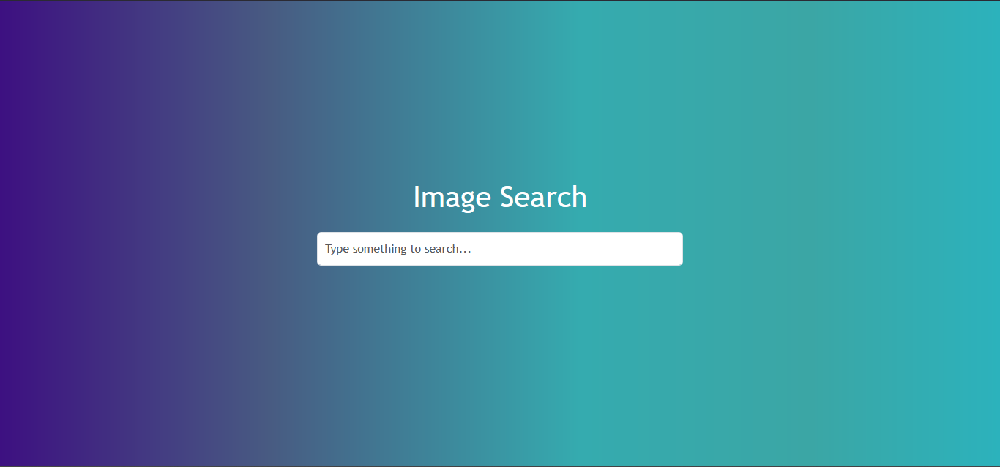
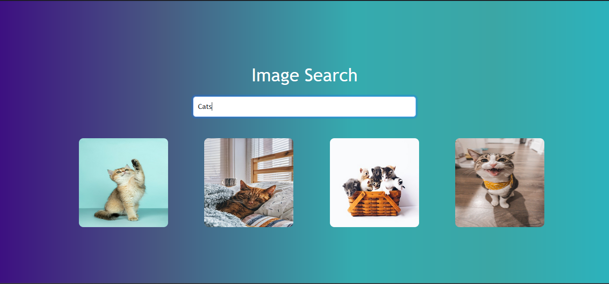

## Steps to run this application

- Add your Unsplash Api key in `.env` file
- Execute `npm install` or `yarn install` command to install packages
- Execute `npm run dev` or `yarn run dev` command to start the application
- Access the application at the URL displayed in the terminal

